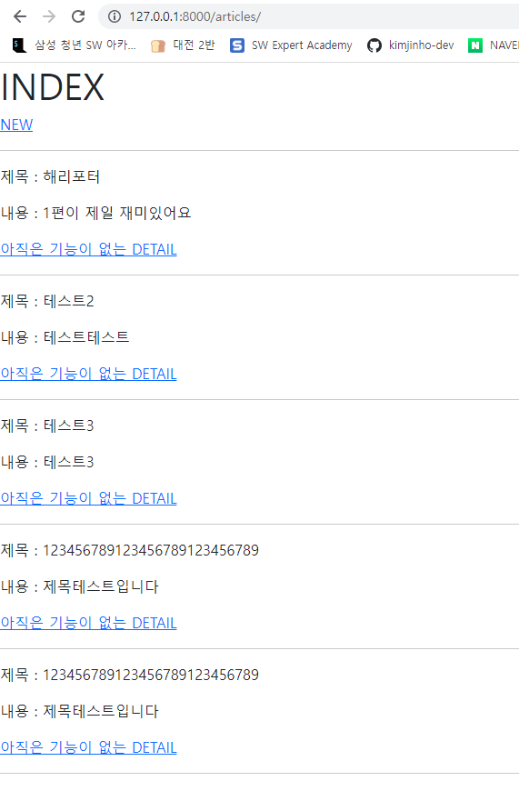
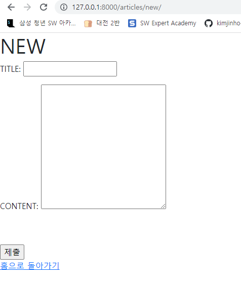

# 웹페이지 사진

## index




## new



# url

## ./crud/urls.py

```python
from django.contrib import admin
from django.urls import path,include

urlpatterns = [
    path('admin/', admin.site.urls),
    path('articles/', include('articles.urls'))
]
```

## ./articles/urls.py

```python
from django.urls import path
from . import views

app_name = 'articles'
urlpatterns = [
    path('', views.index, name='index'),
    path('new/', views.new, name='new'),
    path('create/', views.create, name='create'),
]
```

# view

## ./articles/views.py 

```python
from django.shortcuts import render
from .models import Article

def index(request):
    articles = Article.objects.all()
    context = {
        'articles' : articles
    }
    return render(request, 'articles/index.html', context)

def new(request):
    return render(request, 'articles/new.html')

def create(request):
    title = request.GET.get('title')
    content = request.GET.get('content')
    article = Article(title=title, content=content)
    article.save()
    return render(request, 'articles/create.html')
```

# template

## ./teplates/base.html

```html
<!DOCTYPE html>
<html lang="en">
<head>
  <meta charset="UTF-8">
  <meta http-equiv="X-UA-Compatible" content="IE=edge">
  <meta name="viewport" content="width=device-width, initial-scale=1.0">
  <link href="https://cdn.jsdelivr.net/npm/bootstrap@5.1.3/dist/css/bootstrap.min.css" rel="stylesheet" integrity="sha384-1BmE4kWBq78iYhFldvKuhfTAU6auU8tT94WrHftjDbrCEXSU1oBoqyl2QvZ6jIW3" crossorigin="anonymous">

  <title>Document</title>
</head>
<body>
  
  
  
  <script src="https://cdn.jsdelivr.net/npm/bootstrap@5.1.3/dist/js/bootstrap.bundle.min.js" integrity="sha384-ka7Sk0Gln4gmtz2MlQnikT1wXgYsOg+OMhuP+IlRH9sENBO0LRn5q+8nbTov4+1p" crossorigin="anonymous"></script>
</body>
</html>
```

## /articles/templates/articles/index.html

```html



  <h1>INDEX</h1>
  <a href="  ">NEW</a>
  <hr>
  
    <p>제목 : {{article.title}} </p>
    <p>내용 : {{article.content}} </p>
    <a href="#">아직은 기능이 없는 DETAIL</a>
    <hr>
    

```

## /articles/templates/articles/new.html

```html



<h1>NEW</h1>
<form action="  " method="GET">
  <label for="title">TITLE:</label>
  <input type="text" id="title" name="title">
  <br>
  <dir class="ps-0 md-0" style="height:300px">
    <label for="content" class="">CONTENT:</label>
     <input type="text" id="content" name="content" class="col-3"> 
    <textarea name="content" id="content" cols="30" rows="10"></textarea>
  </dir>
  <input type="submit">
</form>
<a href="  ">홈으로 돌아가기</a>

```

##  /articles/templates/articles/catch.html 
(해당 페이지 없이 구성을 못해서 추가)  

```html



  <p>작성완료!</p>
  <a href="  ">작성으로 돌아가기</a>

```

  
# model  

  
## ./articles/models.py

```python
from django.db import models

class Article(models.Model):
    title = models.CharField(max_length=20)
    content = models.TextField()
    created_at = models.DateTimeField(auto_now_add=True)
    updated_at = models.DateTimeField(auto_now=True)
```

